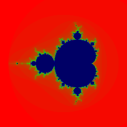
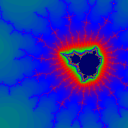
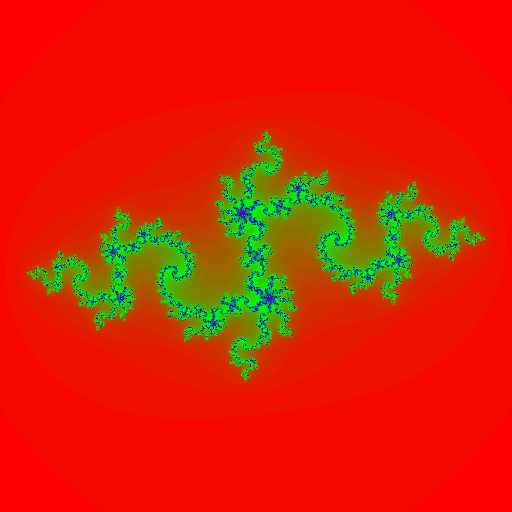

# jlr-mandelbrot-rust
A Mandelbrot fractal viewer/browser written in the Rust programming language.
Supports zooming in and out.

Julia sets are also supported:

## Quick Start and Installation:
 * Install Rust, if not already installed.  
   Instructions:  https://www.rust-lang.org/tools/install
 * Type:  rustup update
 * Change to the directory where you want this program to live.
 * Type:  git clone https://github.com/Sparrow-guy/jlr-mandelbrot-rust.git
 * Type:  cd jlr-mandelbrot-rust
 * Type:  cargo run
 * Interact:  Left-click zooms in; right-click zooms out.

